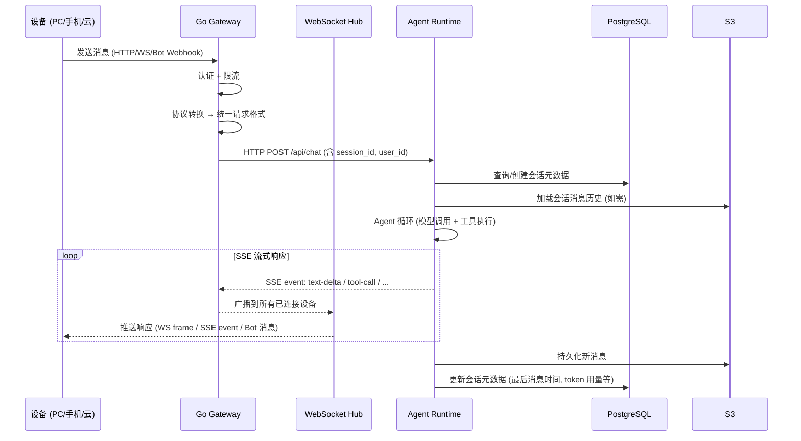

# 设计文档：多设备协作与包合并

## 概述

本设计文档定义 agent-flow 平台多设备协作能力与 monorepo 包合并优化的技术方案。核心目标是让用户从 PC（CLI / Playground）、手机（飞书 Bot）、云服务器三种设备无缝接入同一 Agent 会话，同时通过可扩展的 Bot 插件架构支持未来接入更多消息平台。

### 设计原则

1. **Gateway 负责连接，Runtime 负责智能**：Go Gateway 处理认证、路由、协议转换等性能关键路径；Node.js Agent Runtime 处理 Agent 循环、模型调用、上下文管理等 AI 逻辑路径
2. **插件化扩展**：Bot 接入层采用插件架构，新平台接入只需实现标准接口并注册
3. **会话即状态**：所有设备共享同一 Session ID，会话状态服务端持久化，任何设备可恢复
4. **渐进式合并**：包合并保持 API 兼容（subpath exports），消费方可渐进迁移
5. **独立性保留**：Console、CLI、chat-ui、ai-sdk adapter 保持独立，不参与合并

### 关键设计决策

| 决策 | 选择 | 理由 |
|------|------|------|
| WebSocket 实现 | Go `gorilla/websocket` | Gateway 已用 Go，gorilla 是 Go 生态最成熟的 WS 库 |
| Bot 插件注册 | Go 接口 + 运行时注册表 | 插件与 Gateway 同进程，避免 IPC 开销；Go 接口天然支持多态 |
| Gateway ↔ Runtime 通信 | HTTP 反向代理 + SSE 透传 | 复用现有 `proxy.LLMProxy` 架构，SSE 透传避免缓冲 |
| 会话持久化 | PostgreSQL 元数据 + S3 JSONL | 元数据查询走 PG，大体积消息历史走对象存储，成本与性能平衡 |
| 包合并策略 | subpath exports 保持兼容 | 消费方 import 路径可渐进迁移，不需要一次性全量替换 |
| 飞书消息格式 | 消息卡片（Interactive Card） | 支持 Markdown 渲染、按钮交互、长文本折叠，体验优于纯文本 |

---

## 架构

### 整体架构图

```mermaid
graph TB
    subgraph 客户端设备
        PC[PC - CLI / Playground Web UI]
        Phone[手机 - 飞书 Bot]
        Cloud[云服务器 - Remote CLI]
    end

    subgraph "Go Gateway (apps/api-gateway)"
        Auth[认证中间件<br/>API Key / Bot Token]
        WSHub[WebSocket Hub<br/>连接管理 + 广播]
        BotRouter[Bot Webhook Router<br/>插件路由]
        PluginReg[Plugin Registry<br/>插件注册中心]
        ProtoConv[协议转换层<br/>WS/Bot → 统一请求]
        RProxy[反向代理<br/>SSE 透传]

        Auth --> WSHub
        Auth --> BotRouter
        BotRouter --> PluginReg
        WSHub --> ProtoConv
        BotRouter --> ProtoConv
        ProtoConv --> RProxy
    end

    subgraph "Bot Plugins (Go)"
        FeishuPlugin[飞书 Bot Plugin]
        FuturePlugin[钉钉 / Telegram<br/>未来插件...]
    end

    subgraph "Node.js Agent Runtime (apps/server)"
        AgentLoop[Agent 主循环]
        SessionMgr[会话管理器]
        CtxStore[上下文存储]
        ModelCall[模型调用 - AI SDK]
        ToolExec[工具执行]
        Compressor[上下文压缩]
    end

    subgraph 持久化存储
        PG[(PostgreSQL<br/>会话元数据)]
        S3[(S3<br/>消息历史 JSONL)]
    end

    PC -->|HTTP/SSE| Auth
    PC -->|WebSocket| Auth
    Phone -->|Webhook| BotRouter
    Cloud -->|HTTP/SSE| Auth

    PluginReg --> FeishuPlugin
    PluginReg --> FuturePlugin

    RProxy -->|HTTP + SSE 透传| AgentLoop
    AgentLoop --> SessionMgr
    AgentLoop --> ModelCall
    AgentLoop --> ToolExec
    SessionMgr --> CtxStore
    CtxStore --> Compressor

    SessionMgr --> PG
    SessionMgr --> S3
```



### 请求流转时序



---

## 组件与接口

### 1. Go Gateway 扩展组件

#### 1.1 WebSocket Hub

WebSocket Hub 管理所有设备的实时连接，支持同一会话的多设备广播。

```go
// apps/api-gateway/internal/ws/hub.go

// Hub 管理所有活跃的 WebSocket 连接
type Hub struct {
    // 按 session ID 分组的连接集合
    sessions map[string]map[*Client]struct{}
    // 按 user ID 索引的连接集合（用于用户级广播）
    users    map[string]map[*Client]struct{}
    mu       sync.RWMutex
    // 注册/注销通道
    register   chan *Client
    unregister chan *Client
}

// Client 表示一个 WebSocket 连接
type Client struct {
    ID        string          // 连接唯一 ID (nanoid)
    UserID    string          // 用户 ID (从 API Key 认证获取)
    SessionID string          // 当前会话 ID
    DeviceID  string          // 设备标识
    Conn      *websocket.Conn
    Send      chan []byte     // 出站消息缓冲
}

// WSMessage 是 WebSocket 传输的消息信封
type WSMessage struct {
    Type      string          `json:"type"`       // "chat", "subscribe", "ping", "history"
    SessionID string          `json:"session_id"`
    Payload   json.RawMessage `json:"payload"`
    RequestID string          `json:"request_id"` // 客户端请求追踪 ID
}

// Hub 方法
func (h *Hub) Run()                                          // 主循环，处理注册/注销
func (h *Hub) BroadcastToSession(sessionID string, msg []byte, exclude *Client) // 广播到会话所有设备
func (h *Hub) SendToClient(clientID string, msg []byte)      // 发送到指定客户端
func (h *Hub) GetSessionClients(sessionID string) []*Client  // 获取会话的所有连接
func (h *Hub) Subscribe(client *Client, sessionID string)    // 客户端订阅会话
func (h *Hub) Unsubscribe(client *Client)                    // 客户端取消订阅
```

#### 1.2 Bot Plugin 接口

```go
// apps/api-gateway/internal/bot/plugin.go

// BotPlugin 定义 Bot 插件的标准接口
type BotPlugin interface {
    // PluginID 返回插件唯一标识 (如 "feishu", "dingtalk", "telegram")
    PluginID() string

    // VerifyWebhook 验证 Webhook 请求的签名合法性
    // 返回 true 表示验证通过
    VerifyWebhook(r *http.Request, body []byte) (bool, error)

    // ParseMessage 将平台消息解析为统一的 BotIncomingMessage
    ParseMessage(r *http.Request, body []byte) (*BotIncomingMessage, error)

    // SendReply 将统一回复格式化为平台消息并发送
    SendReply(ctx context.Context, reply *BotOutgoingMessage) error

    // SendTypingIndicator 发送"正在输入"状态 (可选实现)
    SendTypingIndicator(ctx context.Context, chatID string) error

    // UpdateMessage 更新已发送的消息 (用于替换"处理中"临时消息)
    UpdateMessage(ctx context.Context, messageID string, reply *BotOutgoingMessage) error

    // Configure 初始化插件配置 (App ID, Secret 等)
    Configure(config map[string]string) error
}

// BotIncomingMessage 统一的入站消息格式
type BotIncomingMessage struct {
    PlatformUserID string            // 平台用户 ID
    ChatID         string            // 聊天 ID (群聊 ID 或私聊 ID)
    ChatType       string            // "private" | "group"
    MessageID      string            // 平台消息 ID
    MessageType    string            // "text" | "rich_text" | "file"
    TextContent    string            // 纯文本内容
    RichContent    string            // 富文本内容 (Markdown)
    Attachments    []BotAttachment   // 文件附件
    Metadata       map[string]string // 平台特定元数据
}

// BotOutgoingMessage 统一的出站消息格式
type BotOutgoingMessage struct {
    ChatID      string          // 目标聊天 ID
    MessageType string          // "text" | "rich_text" | "card"
    TextContent string          // 纯文本
    RichContent string          // Markdown 富文本
    CardContent json.RawMessage // 平台卡片 JSON (飞书消息卡片等)
    ReplyToID   string          // 回复的消息 ID (可选)
}

// BotAttachment 文件附件
type BotAttachment struct {
    FileName string
    MimeType string
    URL      string // 下载 URL
    Size     int64
}
```

#### 1.3 Plugin Registry

```go
// apps/api-gateway/internal/bot/registry.go

// PluginRegistry 管理 Bot 插件的生命周期
type PluginRegistry struct {
    plugins  map[string]BotPlugin // pluginID -> plugin
    enabled  map[string]bool      // pluginID -> enabled
    mu       sync.RWMutex
}

func NewPluginRegistry() *PluginRegistry

// Register 注册一个新的 Bot 插件
func (r *PluginRegistry) Register(plugin BotPlugin) error

// Get 获取指定插件 (仅返回已启用的)
func (r *PluginRegistry) Get(pluginID string) (BotPlugin, error)

// Enable / Disable 启用或禁用插件
func (r *PluginRegistry) Enable(pluginID string) error
func (r *PluginRegistry) Disable(pluginID string) error

// IsEnabled 检查插件是否启用
func (r *PluginRegistry) IsEnabled(pluginID string) bool

// List 列出所有已注册的插件及其状态
func (r *PluginRegistry) List() []PluginInfo

type PluginInfo struct {
    PluginID string `json:"plugin_id"`
    Enabled  bool   `json:"enabled"`
}
```

#### 1.4 Bot Webhook Handler

```go
// apps/api-gateway/internal/handler/bot.go

type BotHandler struct {
    registry    *bot.PluginRegistry
    userMapper  *service.BotUserMapper  // 平台用户 → agent-flow 用户映射
    agentClient *service.AgentClient    // 转发请求到 Agent Runtime
    hub         *ws.Hub                 // 用于广播回复到 WS 客户端
}

// HandleWebhook 处理 Bot Webhook 回调
// 路由: POST /v1/bot/:plugin/webhook
func (h *BotHandler) HandleWebhook(c echo.Context) error

// HandlePluginList 列出所有插件
// 路由: GET /v1/bot/plugins
func (h *BotHandler) HandlePluginList(c echo.Context) error

// HandlePluginToggle 启用/禁用插件
// 路由: PUT /v1/bot/plugins/:plugin/toggle
func (h *BotHandler) HandlePluginToggle(c echo.Context) error
```

### 2. Agent Runtime 扩展组件

#### 2.1 会话持久化管理器

```typescript
// packages/core/src/session/remote-session-manager.ts

interface SessionMetadata {
  sessionId: string;
  userId: string;
  title: string;
  modelId: string;
  messageCount: number;
  tokenUsage: TokenUsage;
  createdAt: string;       // ISO 8601
  updatedAt: string;
  lastDeviceId: string;
  storageRef: string;      // S3 key for JSONL file
  compactBoundaryUuid: string | null;
}

interface RemoteSessionManager {
  // 创建新会话
  create(userId: string, modelId: string): Promise<SessionMetadata>;

  // 加载会话 (从 PG 元数据 + S3 消息历史)
  load(sessionId: string): Promise<{ metadata: SessionMetadata; messages: UnifiedMessage[] }>;

  // 追加消息 (写入 S3 + 更新 PG 元数据)
  appendMessages(sessionId: string, messages: UnifiedMessage[]): Promise<void>;

  // 更新元数据 (压缩后、模型切换后等)
  updateMetadata(sessionId: string, updates: Partial<SessionMetadata>): Promise<void>;

  // 列出用户的所有会话
  listByUser(userId: string, limit?: number, offset?: number): Promise<SessionMetadata[]>;

  // 删除会话
  delete(sessionId: string): Promise<void>;
}
```

#### 2.2 Gateway ↔ Runtime 通信协议

Gateway 通过 HTTP 反向代理将请求转发给 Agent Runtime。Runtime 的 HTTP API 扩展如下：

```typescript
// apps/server/src/http/routes.ts — 新增路由

// 会话管理
POST   /api/sessions                    // 创建会话
GET    /api/sessions                    // 列出会话 (query: user_id, limit, offset)
GET    /api/sessions/:id                // 获取会话详情
DELETE /api/sessions/:id                // 删除会话

// 对话 (核心)
POST   /api/sessions/:id/chat          // 发送消息 (SSE 流式响应)
GET    /api/sessions/:id/messages      // 获取消息历史 (query: after, limit)

// 健康检查
GET    /api/health                      // 健康检查
```

Gateway 转发请求时注入的 Header：

```
X-User-ID: <user_id>           // 认证后的用户 ID
X-Device-ID: <device_id>       // 设备标识
X-Session-ID: <session_id>     // 会话 ID
X-Request-ID: <request_id>     // 请求追踪 ID
X-Source: "http" | "ws" | "bot:<plugin_id>"  // 请求来源
```

### 3. 包合并组件设计

#### 3.1 合并后的 Core Package 结构

```
packages/core/
├── src/
│   ├── index.ts                    # 主入口，re-export 所有公开 API
│   │
│   ├── messages/                   # 原 model-contracts
│   │   ├── index.ts
│   │   ├── message.ts              # UnifiedMessage, ContentPart, etc.
│   │   ├── model.ts                # ModelCapabilities, ModelInfo
│   │   ├── tool.ts                 # ToolDefinition, ToolResult
│   │   ├── provider.ts             # ProviderAdapter, ChatRequest, ChatResponse
│   │   └── errors.ts               # 统一错误类型
│   │
│   ├── gateway/                    # 原 model-gateway
│   │   ├── index.ts
│   │   ├── gateway.ts              # ModelGateway
│   │   ├── router.ts               # ModelRouter
│   │   ├── fallback.ts             # FallbackChain
│   │   └── rate-limit.ts           # RateLimiter
│   │
│   ├── store/                      # 原 context-store
│   │   ├── index.ts
│   │   ├── store.ts                # ContextStore
│   │   ├── session.ts              # SessionManager
│   │   ├── serializer.ts           # JSONL 序列化
│   │   └── memory-store.ts         # 内存存储
│   │
│   ├── compressor/                 # 原 context-compressor
│   │   ├── index.ts
│   │   ├── compressor.ts           # ContextCompressor
│   │   ├── auto-compact.ts         # 自动压缩
│   │   ├── micro-compact.ts        # 微压缩
│   │   └── prompt.ts               # 摘要 prompt
│   │
│   ├── checkpoint/                 # 原 checkpoint
│   │   ├── index.ts
│   │   ├── checkpoint.ts           # Checkpoint 类型
│   │   ├── local.ts                # LocalCheckpointManager
│   │   ├── remote.ts               # RemoteCheckpointManager
│   │   └── state-machine.ts        # TaskState
│   │
│   ├── sdk/                        # 原 sdk
│   │   ├── index.ts
│   │   └── agent-flow.ts           # AgentFlow 类
│   │
│   ├── agent.ts                    # Agent 主循环 (原 core)
│   ├── query-engine.ts             # QueryEngine
│   ├── tool-registry.ts            # ToolRegistry
│   └── permission.ts               # PermissionManager
│
├── package.json
└── tsconfig.json
```

#### 3.2 Subpath Exports 配置

```json
// packages/core/package.json (合并后)
{
  "name": "@agent-flow/core",
  "exports": {
    ".":            { "types": "./dist/index.d.ts",              "import": "./dist/index.js" },
    "./messages":   { "types": "./dist/messages/index.d.ts",     "import": "./dist/messages/index.js" },
    "./gateway":    { "types": "./dist/gateway/index.d.ts",      "import": "./dist/gateway/index.js" },
    "./store":      { "types": "./dist/store/index.d.ts",        "import": "./dist/store/index.js" },
    "./compressor": { "types": "./dist/compressor/index.d.ts",   "import": "./dist/compressor/index.js" },
    "./checkpoint": { "types": "./dist/checkpoint/index.d.ts",   "import": "./dist/checkpoint/index.js" },
    "./sdk":        { "types": "./dist/sdk/index.d.ts",          "import": "./dist/sdk/index.js" }
  }
}
```

#### 3.3 合并后的 Model Adapters Native 结构

```
packages/model-adapters-native/
├── src/
│   ├── index.ts                    # re-export 所有适配器
│   ├── openai/
│   │   ├── index.ts
│   │   ├── adapter.ts
│   │   └── converter.ts
│   ├── anthropic/
│   │   ├── index.ts
│   │   ├── adapter.ts
│   │   └── converter.ts
│   ├── google/
│   │   ├── index.ts
│   │   ├── adapter.ts
│   │   └── converter.ts
│   └── deepseek/
│       ├── index.ts
│       ├── adapter.ts
│       └── converter.ts
├── package.json
└── tsconfig.json
```

```json
// packages/model-adapters-native/package.json
{
  "name": "@agent-flow/model-adapters-native",
  "exports": {
    ".":           { "types": "./dist/index.d.ts",            "import": "./dist/index.js" },
    "./openai":    { "types": "./dist/openai/index.d.ts",     "import": "./dist/openai/index.js" },
    "./anthropic": { "types": "./dist/anthropic/index.d.ts",  "import": "./dist/anthropic/index.js" },
    "./google":    { "types": "./dist/google/index.d.ts",     "import": "./dist/google/index.js" },
    "./deepseek":  { "types": "./dist/deepseek/index.d.ts",   "import": "./dist/deepseek/index.js" }
  },
  "dependencies": {
    "@agent-flow/core": "workspace:*",
    "openai": "^4.90.0",
    "@anthropic-ai/sdk": "^0.52.0",
    "@google/generative-ai": "^0.24.0"
  }
}
```

---

## 数据模型

### 1. PostgreSQL 数据库扩展

在现有 `api-gateway` 数据库基础上新增以下表：

```sql
-- 会话元数据表
CREATE TABLE sessions (
    id              TEXT PRIMARY KEY,           -- nanoid
    user_id         TEXT NOT NULL REFERENCES users(id),
    title           TEXT NOT NULL DEFAULT '',
    model_id        TEXT NOT NULL,
    message_count   INTEGER NOT NULL DEFAULT 0,
    total_prompt_tokens     BIGINT NOT NULL DEFAULT 0,
    total_completion_tokens BIGINT NOT NULL DEFAULT 0,
    storage_ref     TEXT NOT NULL,              -- S3 key: sessions/{user_id}/{session_id}.jsonl
    compact_boundary_uuid TEXT,                 -- 最新压缩边界的消息 UUID
    last_device_id  TEXT,
    created_at      TIMESTAMPTZ NOT NULL DEFAULT NOW(),
    updated_at      TIMESTAMPTZ NOT NULL DEFAULT NOW()
);

CREATE INDEX idx_sessions_user_id ON sessions(user_id);
CREATE INDEX idx_sessions_updated_at ON sessions(updated_at DESC);

-- 设备连接记录表
CREATE TABLE device_connections (
    id              TEXT PRIMARY KEY,           -- nanoid
    user_id         TEXT NOT NULL REFERENCES users(id),
    session_id      TEXT REFERENCES sessions(id),
    device_id       TEXT NOT NULL,
    device_type     TEXT NOT NULL,              -- "cli" | "web" | "bot:feishu" | "bot:dingtalk"
    connected_at    TIMESTAMPTZ NOT NULL DEFAULT NOW(),
    disconnected_at TIMESTAMPTZ,
    last_active_at  TIMESTAMPTZ NOT NULL DEFAULT NOW()
);

CREATE INDEX idx_device_connections_session ON device_connections(session_id)
    WHERE disconnected_at IS NULL;

-- Bot 用户映射表 (平台用户 → agent-flow 用户)
CREATE TABLE bot_user_mappings (
    id              TEXT PRIMARY KEY,           -- nanoid
    platform        TEXT NOT NULL,              -- "feishu" | "dingtalk" | "telegram"
    platform_user_id TEXT NOT NULL,
    user_id         TEXT NOT NULL REFERENCES users(id),
    default_session_id TEXT REFERENCES sessions(id),
    metadata        JSONB DEFAULT '{}',         -- 平台特定数据 (昵称、头像等)
    created_at      TIMESTAMPTZ NOT NULL DEFAULT NOW(),
    updated_at      TIMESTAMPTZ NOT NULL DEFAULT NOW(),
    UNIQUE(platform, platform_user_id)
);

-- Bot 插件配置表
CREATE TABLE bot_plugin_configs (
    id              TEXT PRIMARY KEY,           -- nanoid
    plugin_id       TEXT NOT NULL UNIQUE,       -- "feishu" | "dingtalk"
    enabled         BOOLEAN NOT NULL DEFAULT true,
    config          JSONB NOT NULL DEFAULT '{}', -- 加密的配置 (App ID, Secret 等)
    created_at      TIMESTAMPTZ NOT NULL DEFAULT NOW(),
    updated_at      TIMESTAMPTZ NOT NULL DEFAULT NOW()
);

-- 消息同步游标表 (跟踪每个设备的消息同步位置)
CREATE TABLE sync_cursors (
    id              TEXT PRIMARY KEY,
    device_id       TEXT NOT NULL,
    session_id      TEXT NOT NULL REFERENCES sessions(id),
    last_message_uuid TEXT NOT NULL,            -- 该设备最后接收的消息 UUID
    updated_at      TIMESTAMPTZ NOT NULL DEFAULT NOW(),
    UNIQUE(device_id, session_id)
);
```

### 2. S3 存储结构

```
agent-flow-sessions/
├── {user_id}/
│   ├── {session_id}.jsonl          # 完整消息历史 (append-only)
│   ├── {session_id}.compact.jsonl  # 压缩后的消息历史 (压缩时重写)
│   └── {session_id}.meta.json      # 会话快照元数据 (冗余备份)
```

### 3. WebSocket 消息协议

```typescript
// 客户端 → 服务端
type ClientWSMessage =
  | { type: 'subscribe';  session_id: string }
  | { type: 'unsubscribe' }
  | { type: 'chat';       session_id: string; content: string; request_id: string }
  | { type: 'history';    session_id: string; after?: string; limit?: number }
  | { type: 'ping' }

// 服务端 → 客户端
type ServerWSMessage =
  | { type: 'subscribed';    session_id: string }
  | { type: 'chat.start';   request_id: string; session_id: string }
  | { type: 'chat.delta';   request_id: string; delta: StreamChunk }
  | { type: 'chat.end';     request_id: string; message: UnifiedMessage }
  | { type: 'chat.error';   request_id: string; error: { code: string; message: string } }
  | { type: 'history';      session_id: string; messages: UnifiedMessage[]; has_more: boolean }
  | { type: 'sync';         session_id: string; messages: UnifiedMessage[] }  // 断线重连后的增量同步
  | { type: 'pong' }
```

### 4. Gateway 统一内部请求格式

```go
// apps/api-gateway/internal/model/request.go

// UnifiedChatRequest 是 Gateway 内部的统一请求格式
// 无论来源是 HTTP、WebSocket 还是 Bot Webhook，都转换为此格式
type UnifiedChatRequest struct {
    UserID    string `json:"user_id"`
    SessionID string `json:"session_id"`
    DeviceID  string `json:"device_id"`
    Source    string `json:"source"`     // "http" | "ws" | "bot:feishu"
    RequestID string `json:"request_id"`
    Content   string `json:"content"`
    // Bot 特定字段
    BotChatID   string `json:"bot_chat_id,omitempty"`   // Bot 回复目标
    BotMsgID    string `json:"bot_msg_id,omitempty"`    // Bot 原始消息 ID
    BotPluginID string `json:"bot_plugin_id,omitempty"` // Bot 插件 ID
}
```

### 5. Import 路径迁移映射

| 旧路径 | 新路径 |
|--------|--------|
| `@agent-flow/model-contracts` | `@agent-flow/core/messages` |
| `@agent-flow/model-gateway` | `@agent-flow/core/gateway` |
| `@agent-flow/context-store` | `@agent-flow/core/store` |
| `@agent-flow/context-compressor` | `@agent-flow/core/compressor` |
| `@agent-flow/checkpoint` | `@agent-flow/core/checkpoint` |
| `@agent-flow/sdk` | `@agent-flow/core/sdk` |
| `@agent-flow/model-adapter-openai` | `@agent-flow/model-adapters-native/openai` |
| `@agent-flow/model-adapter-anthropic` | `@agent-flow/model-adapters-native/anthropic` |
| `@agent-flow/model-adapter-google` | `@agent-flow/model-adapters-native/google` |
| `@agent-flow/model-adapter-deepseek` | `@agent-flow/model-adapters-native/deepseek` |


---

## 正确性属性

*正确性属性是在系统所有有效执行中都应成立的特征或行为——本质上是对系统应做什么的形式化陈述。属性是人类可读规格说明与机器可验证正确性保证之间的桥梁。*

### Property 1: 会话持久化往返一致性

*For any* 有效的 UnifiedMessage 序列，将其持久化到存储（PostgreSQL 元数据 + S3 JSONL）后再加载回来，应产生与原始序列内容相同、顺序一致的消息数组。

**Validates: Requirements 1.2, 9.1, 9.2**

### Property 2: WebSocket Hub 广播完整性

*For any* 会话中的已连接客户端集合和任意消息，当 Hub 执行广播时，该会话中的所有客户端（除发送者外）都应收到该消息，且其他会话的客户端不应收到该消息。

**Validates: Requirements 1.4**

### Property 3: 断线重连同步准确性

*For any* 消息历史和任意同步游标位置，重连后的增量同步应返回恰好是游标之后的所有消息，不多不少，且顺序与原始消息历史一致。

**Validates: Requirements 1.5**

### Property 4: 协议转换有效性

*For any* 有效的 WebSocket 消息或 Bot Webhook 载荷，经过协议转换后应产生一个包含所有必填字段（user_id、session_id、content、source）的有效 UnifiedChatRequest，且原始消息内容不丢失。

**Validates: Requirements 2.4**

### Property 5: 插件注册端点创建

*For any* 实现了 BotPlugin 接口的插件，注册到 PluginRegistry 后，对应的 Webhook 端点（`/v1/bot/{pluginID}/webhook`）应变为可达（非 404），且插件 ID 与端点路径一一对应。

**Validates: Requirements 3.2**

### Property 6: Bot 消息格式往返一致性

*For any* 包含纯文本、富文本（Markdown）或文件附件的 UnifiedMessage，将其转换为平台消息格式再转换回 UnifiedMessage，文本内容和附件元数据应保持不变。

**Validates: Requirements 3.3**

### Property 7: Webhook 签名验证正确性

*For any* 随机载荷和密钥，使用正确密钥计算的签名应通过验证；对同一载荷使用任何不同的签名应验证失败。

**Validates: Requirements 3.4**

### Property 8: 消息发送重试约束

*For any* 模拟的消息发送失败序列，重试次数不应超过 3 次，且连续重试之间的延迟应遵循指数退避模式（每次延迟 ≥ 前次延迟的 2 倍）。

**Validates: Requirements 3.5**

### Property 9: 插件启用/禁用状态一致性

*For any* 插件和任意启用/禁用操作序列，插件的 Webhook 端点返回的 HTTP 状态码应与当前启用状态一致：启用时正常处理请求，禁用时返回 503。

**Validates: Requirements 3.6**

### Property 10: 飞书消息解析完整性

*For any* 有效的飞书事件订阅消息载荷（包含不同聊天类型、消息类型、内容长度），解析后的 BotIncomingMessage 应包含正确的 platform_user_id、chat_id、chat_type，且文本内容与原始消息一致。

**Validates: Requirements 4.2**

### Property 11: 压缩后持久化一致性

*For any* 消息序列，在触发上下文压缩后将结果持久化再加载，加载的状态应包含压缩边界标记，且边界之后的消息与压缩前的近期消息一致。

**Validates: Requirements 9.4**

---

## 错误处理

### 1. Gateway 层错误处理

| 错误场景 | 处理策略 | HTTP 状态码 |
|----------|---------|------------|
| API Key 无效或过期 | 返回认证错误，关闭 WS 连接 | 401 |
| 请求超过限流阈值 | 返回限流错误，附带 Retry-After header | 429 |
| WebSocket 连接异常断开 | 从 Hub 注销客户端，清理资源，记录日志 | N/A |
| Bot Webhook 签名验证失败 | 拒绝请求，记录安全日志 | 403 |
| 插件已禁用 | 返回服务不可用 | 503 |
| Agent Runtime 不可达 | 返回网关错误，触发健康检查 | 502 |
| Agent Runtime 响应超时 | 返回超时错误（默认 300s） | 504 |
| 请求体过大 | 拒绝请求 | 413 |

### 2. Bot 插件错误处理

```go
// 重试策略
type RetryConfig struct {
    MaxRetries     int           // 最大重试次数: 3
    InitialDelay   time.Duration // 初始延迟: 1s
    MaxDelay       time.Duration // 最大延迟: 30s
    BackoffFactor  float64       // 退避因子: 2.0
}

// 重试逻辑
func (p *BasePlugin) SendWithRetry(ctx context.Context, msg *BotOutgoingMessage) error {
    var lastErr error
    delay := p.retryConfig.InitialDelay

    for attempt := 0; attempt <= p.retryConfig.MaxRetries; attempt++ {
        if attempt > 0 {
            select {
            case <-ctx.Done():
                return ctx.Err()
            case <-time.After(delay):
            }
            delay = time.Duration(float64(delay) * p.retryConfig.BackoffFactor)
            if delay > p.retryConfig.MaxDelay {
                delay = p.retryConfig.MaxDelay
            }
        }

        lastErr = p.plugin.SendReply(ctx, msg)
        if lastErr == nil {
            return nil
        }
        slog.Warn("bot send failed, retrying",
            "plugin", p.plugin.PluginID(),
            "attempt", attempt+1,
            "error", lastErr,
        )
    }
    return fmt.Errorf("send failed after %d retries: %w", p.retryConfig.MaxRetries, lastErr)
}
```

### 3. 会话持久化错误处理

| 错误场景 | 处理策略 |
|----------|---------|
| S3 写入失败 | 回退到本地 JSONL 文件存储，启动后台同步任务 |
| S3 读取失败 | 尝试从本地缓存加载，若无缓存则返回错误 |
| PostgreSQL 连接失败 | 使用连接池重试（pgx 内置），超时后返回 503 |
| 消息序列化失败 | 记录错误日志，跳过该消息，不中断会话 |
| 会话加载时 JSONL 格式损坏 | 尝试逐行解析，跳过损坏行，记录警告 |
| 压缩持久化失败 | 保留内存中的压缩状态，下次持久化时重试 |

### 4. WebSocket 连接错误处理

```go
// 心跳检测
const (
    PingInterval = 30 * time.Second
    PongTimeout  = 10 * time.Second
    WriteTimeout = 10 * time.Second
)

func (c *Client) ReadPump(hub *Hub) {
    defer func() {
        hub.unregister <- c
        c.Conn.Close()
    }()

    c.Conn.SetReadDeadline(time.Now().Add(PingInterval + PongTimeout))
    c.Conn.SetPongHandler(func(string) error {
        c.Conn.SetReadDeadline(time.Now().Add(PingInterval + PongTimeout))
        return nil
    })

    for {
        _, message, err := c.Conn.ReadMessage()
        if err != nil {
            if websocket.IsUnexpectedCloseError(err,
                websocket.CloseGoingAway,
                websocket.CloseNormalClosure) {
                slog.Warn("ws unexpected close", "client", c.ID, "err", err)
            }
            break
        }
        // 处理消息...
    }
}
```

### 5. 包合并错误处理

| 错误场景 | 处理策略 |
|----------|---------|
| 旧 import 路径残留 | CI 中添加 lint 规则，检测 `@agent-flow/model-contracts` 等旧路径 |
| subpath export 解析失败 | 在 tsconfig.json 中配置 `paths` 映射作为后备 |
| 循环依赖引入 | 合并时通过 `madge` 工具检测循环依赖 |
| 类型冲突 | 合并前确保无同名但不同定义的类型导出 |

---

## 测试策略

### 双重测试方法

本特性采用单元测试 + 属性测试的双重策略：

- **单元测试**：验证具体示例、边界条件和错误场景
- **属性测试**：验证跨所有输入的通用属性（使用 property-based testing）
- 两者互补：单元测试捕获具体 bug，属性测试验证通用正确性

### 属性测试配置

- **测试库**：
  - TypeScript: `fast-check`（与 Vitest 集成）
  - Go: `testing/quick` + `gopter`（Go 生态主流 PBT 库）
- **最小迭代次数**：每个属性测试 100 次
- **标签格式**：`Feature: multi-device-collaboration, Property {number}: {property_text}`

### 测试分层

#### 1. 属性测试（Property-Based Tests）

| Property | 测试目标 | 生成器 | 语言 |
|----------|---------|--------|------|
| P1: 会话持久化往返 | RemoteSessionManager.appendMessages → load | 随机 UnifiedMessage 序列 | TypeScript |
| P2: Hub 广播完整性 | Hub.BroadcastToSession | 随机客户端集合 + 随机消息 | Go |
| P3: 断线重连同步 | SyncCursor 机制 | 随机消息历史 + 随机游标位置 | TypeScript |
| P4: 协议转换有效性 | WSMessage/BotIncoming → UnifiedChatRequest | 随机 WS 消息和 Bot 载荷 | Go |
| P5: 插件注册端点 | PluginRegistry.Register | 随机插件 ID | Go |
| P6: Bot 消息往返 | BotPlugin 消息转换 | 随机 UnifiedMessage（含各类型内容） | Go |
| P7: 签名验证 | BotPlugin.VerifyWebhook | 随机载荷 + 随机密钥 | Go |
| P8: 重试约束 | SendWithRetry | 随机失败序列 | Go |
| P9: 启用/禁用一致性 | PluginRegistry.Enable/Disable | 随机操作序列 | Go |
| P10: 飞书消息解析 | FeishuPlugin.ParseMessage | 随机飞书事件载荷 | Go |
| P11: 压缩持久化往返 | 压缩 → 持久化 → 加载 | 随机消息序列 + 压缩触发 | TypeScript |

#### 2. 单元测试（Example-Based）

| 测试目标 | 具体场景 |
|----------|---------|
| WebSocket 认证 | 有效 API Key 连接成功；无效 Key 被拒绝；过期 Key 被拒绝 |
| 飞书签名验证 | 使用飞书官方测试向量验证签名计算 |
| 飞书临时消息 | 长任务时先发"处理中"，完成后更新为最终结果 |
| subpath export 解析 | 每个子路径导出正确解析到对应模块 |
| 旧 import 路径检测 | lint 规则正确检测残留的旧路径 |
| SSE 透传 | Gateway 不缓冲 SSE 事件，逐事件转发 |

#### 3. 集成测试

| 测试目标 | 场景 |
|----------|------|
| 端到端消息流转 | HTTP 客户端 → Gateway → Runtime → 响应 → 客户端 |
| WS 端到端 | WS 客户端 → Gateway → Runtime → 广播 → 所有 WS 客户端 |
| Bot 端到端 | 飞书 Webhook → Gateway → Runtime → 飞书回复 |
| 多设备同步 | 设备 A 发消息 → 设备 B 收到广播 → 设备 C 断线重连收到同步 |
| 存储回退 | S3 不可用 → 本地回退 → S3 恢复 → 自动同步 |
| 构建验证 | `pnpm build` 全量构建无错误 |
| 测试验证 | `pnpm test` 全量测试无失败 |

#### 4. 冒烟测试

| 测试目标 | 验证内容 |
|----------|---------|
| WS 端点可用 | `/v1/ws` 可连接 |
| Bot 端点可用 | `/v1/bot/feishu/webhook` 可达 |
| subpath exports | 所有子路径导出可正确 import |
| 旧包已删除 | 已合并包的目录不存在 |
| 空存根已删除 | `bedrock`、`gemini` 目录不存在 |
| 独立包完整 | ai-sdk adapter、chat-ui、cli、console 仍独立存在 |
