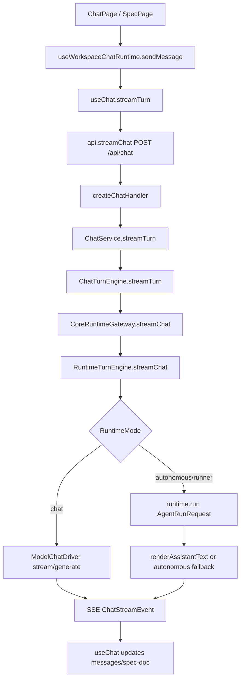

# Agent Core Flow（基于 web-server 重构后）

本文是 `query -> /api/chat -> web-server -> runtime/core` 的最新主链路速查，按 `apps/web-server` 现有代码结构更新。
不展开 admin/provider/auth 等非聊天主路径细节。

## 1. 关键文件（重构后）

### 前端入口

| 路径 | 作用 |
| --- | --- |
| `apps/web-ui/src/pages/ChatPage.tsx` | 普通对话页入口，组装 ChatPanel 和会话上下文。 |
| `apps/web-ui/src/pages/SpecPage.tsx` | Spec 工作台入口，处理文档面板与阶段确认。 |
| `apps/web-ui/src/hooks/useWorkspaceChatRuntime.ts` | Chat/Spec 页面运行时聚合层（模型、runner、审批、发送消息）。 |
| `apps/web-ui/src/hooks/useChat.ts` | 前端流式会话核心：optimistic message、SSE 事件消费、审批重放。 |
| `apps/web-ui/src/api.ts` | `streamChat()` 通过 `POST /api/chat` 建立 SSE 消费。 |

### web-server Chat 与 Runtime 分层

| 路径 | 作用 |
| --- | --- |
| `apps/web-server/src/routes/chat.ts` | 注册 `POST /chat`、`POST /chat/:session_id/retry`、`DELETE /chat/:session_id/messages/:msg_id`。 |
| `apps/web-server/src/handlers/chat-handlers.ts` | `/chat` 请求分流：`background_task` / `stream` / 同步；并处理 SSE 错误事件。 |
| `apps/web-server/src/services/chat-service.ts` | 薄服务层：把 turn 处理委托给 `ChatTurnEngine`。 |
| `apps/web-server/src/chat/turn/chat-turn-engine.ts` | Turn 业务编排主引擎（prepare、落库、memory、spec 协调、retry/confirm）。 |
| `apps/web-server/src/chat/turn/turn-preparer.ts` | 组装 session、history、user message，必要时包装 spec prompt。 |
| `apps/web-server/src/chat/turn/spec-stream-coordinator.ts` | spec 模式下的流式文档协调、摘要消息、自动 regenerate。 |
| `apps/web-server/src/chat/turn/memory-recorder.ts` | 会话记忆写入（best-effort，失败不阻塞主流程）。 |
| `apps/web-server/src/services/runtime-gateway.ts` | `CoreRuntimeGateway`：ChatService 与 runtime 子系统桥接层。 |
| `apps/web-server/src/runtime/runtime-turn-engine.ts` | Runtime 主引擎：记忆召回、模式路由、core 执行、fallback。 |
| `apps/web-server/src/runtime/runtime-router.ts` | `chat/autonomous/runner` 模式判定与 `/run` 指令解析。 |
| `apps/web-server/src/runtime/runtime-request-builder.ts` | 把 chat turn 构造成 `AgentRunRequest`。 |
| `apps/web-server/src/runtime/model-chat-driver.ts` | 模型流式/非流式聊天驱动，支持模型侧工具调用循环。 |
| `apps/web-server/src/runtime/model-tool-runner.ts` | 把模型工具调用映射到 core tool executor 执行。 |
| `apps/web-server/src/runtime/message-mappers.ts` | adapter/core/runtime 消息与事件互转。 |
| `apps/web-server/src/contracts/api.ts` | `RuntimeChatInput`、`ChatStreamEvent`、`SessionRecord` 等前后端契约。 |

### core 集成

| 路径 | 作用 |
| --- | --- |
| `apps/web-server/src/runtime/core-runtime-factory.ts` | 组装 `createCoreAgentRuntimeBundle()`（tool registry/executor/runtime）。 |
| `apps/web-server/src/runtime/llm-step-executor.ts` | `ModelBackedLlmStepExecutor`：给 core 的 `llm` step 提供真实模型执行。 |
| `packages/core/src/index.ts` | `createAgent()` 与 `DefaultAgentRuntime.run/resume()` 主入口。 |
| `packages/core/src/orchestration/planner/index.ts` | `CapabilityPlanner` 计划决策（runner / tool-first / coding / decomposed / direct）。 |
| `packages/core/src/orchestration/executor/index.ts` | `DefaultPlanExecutor`：DAG 调度，执行 `llm/tool/runner` step，产出 event/checkpoint。 |
| `packages/core/src/types/index.ts` | `AgentRunRequest`、`AgentPlan`、`AgentEvent`、`AgentRunResult` 等核心类型。 |

## 2. 主链路总览

主线步骤：

1. 前端 `useChat` 先插入 optimistic user message，再调用 `/api/chat`（`stream=true`）。
2. `createChatHandler` 解析 schema 后进入流式分支，迭代 `chatService.streamTurn()`。
3. `ChatTurnEngine` 完成 prepare、user message 落库、memory 记录，再调用 runtime gateway。
4. `RuntimeTurnEngine` 先召回 memory，再按 runtime mode 走模型聊天或 core runtime。
5. 后端统一返回 `ChatStreamEvent`，前端消费 `msg`/`msg_delta`/`spec_doc_update`/`approval_req`/`error`。

## 3. ChatTurnEngine（重构后核心变化）

`ChatService` 不再承载大段逻辑，核心下沉到 `chat/turn/*`：

1. `TurnPreparer.prepare()`：
   - 解析 `modelId`（支持 `profile_id -> modelId`）。
   - 复用或创建 session。
   - 拉取 history 并构建 user `UnifiedMessage`。
   - spec 模式下自动包装 phase prompt（或标记 `specAutoPrompt` 元消息）。

2. `ChatTurnEngine.streamTurn()`：
   - 先 append user message，并 emit 一条 `type='msg'`（前端会跳过 user 重复渲染）。
   - 写会话记忆（best-effort）。
   - 调用 `runtimeGateway.streamChat()` 消费事件。
   - 与 `SpecStreamCoordinator` 协作处理 spec 文档增量/最终文档/自动重试。

3. `SpecStreamCoordinator`：
   - 把 spec `msg_delta` 汇总成 `spec_doc_update(done=false)`。
   - assistant 最终消息会尝试 `captureAssistantDocument()`，并发一条摘要 `msg`（提示到侧栏看文档）。
   - tasks 文档不满足 contract 时，会自动生成 regenerate prompt 并重启本轮（最多 2 次）。

4. `retry/delete/confirm` 也统一通过 `ChatTurnEngine`：
   - `retryFromMessage()`：定位目标 user message，truncate 后重跑 turn。
   - `deleteMessage()`：删除指定消息之后的历史。
   - `confirmSpecPhase()`：确认 spec 阶段并可自动触发下一阶段 prompt。

## 4. Runtime 模式路由（从“仅 /run”升级为三态）

`runtime-router.ts` 的新决策规则：

1. 命中 `/run <command ...>`：`runtimeMode='runner'`。
2. `session.mode === 'spec'`：强制 `runtimeMode='autonomous'`。
3. 闲聊短句（hi/hello/你好/谢谢 等）走 `runtimeMode='chat'`。
4. 有附件、project、cwd，或命中任务行动词（含中英文）走 `runtimeMode='autonomous'`。
5. 其余默认 `runtimeMode='chat'`。

这意味着现在很多“看起来像任务执行”的自然语言请求，即使没有 `/run`，也会进入 core runtime。

## 5. RuntimeTurnEngine 执行细节

### 5.1 chat 模式

1. `ModelChatDriver.streamModelResponse()` 优先流式。
2. 流式失败且尚未输出 delta 时，回退到 `generateModelResponse()`。
3. 支持模型侧工具调用循环（最多 4 轮），tool spec 来自 `ModelToolRunner.getModelToolSpecs()`。

### 5.2 autonomous / runner 模式

1. `buildAgentRequest()` 构造 `AgentRunRequest`：
   - `goal`：用户请求 + 历史摘要 + 相关 memory + runner directive。
   - `initialContext`：环境上下文、最近 history、memory、附件摘要。
   - `metadata`：`sessionId`、`preferredRunnerId`、审批票据、reasoningEffort 等。

2. 调用 `runtime.run(request, { onEvent })`：
   - `runner.event` / `step.failed` 会映射为可流式展示的 meta message。
   - 若结果里包含审批需求，转成 `approval_req` 事件返回前端。

3. 结果渲染：
   - `renderAssistantText()` 尝试将 runtime outputs 渲染为可读文本（fs/shell 等有专门渲染器）。
   - 若输出是 placeholder 或无可读文本，触发“自治模型补全”fallback（最多 2 轮工具调用）。

## 6. /chat API 与 SSE 契约

### 6.1 Chat 相关接口

1. `POST /chat`：创建一轮对话（支持 `stream/background_task`）。
2. `POST /chat/:session_id/retry`：从历史消息重试该轮。
3. `DELETE /chat/:session_id/messages/:msg_id`：删除某条消息并截断后续。

### 6.2 createChatBodySchema 关键字段

1. `session_id` / `project_id` / `mode`。
2. `message`（必填）。
3. `profile_id` / `model_id` / `reasoning_effort`。
4. `attachments`（最多 10）。
5. `approve_risky_ops` / `approval_ticket`。
6. `stream` / `background_task`。

### 6.3 SSE 事件

1. `msg`：完整消息（user/assistant/tool/meta）。
2. `msg_delta`：assistant 文本增量。
3. `spec_doc_update`：spec 文档增量或完成态。
4. `approval_req`：高风险操作审批请求。
5. `error`：流式阶段错误。

## 7. Spec 工作流（与重构后的 turn 引擎对齐）

Spec 仍复用 `/api/chat`，但行为由 `SpecWorkflowService + SpecStreamCoordinator` 强约束：

1. Phase 顺序：`requirements -> design -> tasks`。
2. 每个 phase 输出有固定 Markdown contract，服务端会校验结构。
3. tasks phase 校验失败时会自动 regenerate（最多 2 次）。
4. 文档正文通过 `spec_doc_update` 进侧栏，聊天区显示摘要消息。
5. `POST /spec/:session_id/confirm` 可推进阶段，并自动注入下一阶段 prompt。

## 8. Runner 与高风险审批

1. 前端接到 `approval_req` 后，调用 `issueRunnerApprovalTicket()` 生成 `approval_ticket`。
2. `useChat.approvePendingRequest()` 用原始 pending input 重放本轮请求（不重复 optimistic user message）。
3. 后端在 tool 执行失败信息中识别审批需求，并通过 `ApprovalRequiredError` / `approval_req` 统一回传。

## 9. packages/core 对接关系

`createServices()` 中的 runtime 装配关系：

1. `createCoreAgentRuntimeBundle()` 注册 builtin tools + runner-backed tools。
2. 注入 `ModelBackedLlmStepExecutor`，让 core `llm` step 走真实模型执行而非纯 placeholder。
3. `CoreRuntimeGateway` 组合：
   - `AgentRuntime`
   - `ModelChatDriver`
   - `ModelToolRunner`
   - `RuntimeTurnEngine`

core 内部执行仍是：

1. `CapabilityPlanner.plan()` 产出 plan。
2. `DefaultPlanExecutor.execute()` 按 DAG 批次执行 `llm/tool/runner`。
3. 产出 `AgentEvent` 与 checkpoint，最终汇总 `AgentRunResult`。

## 10. 一句话总结

重构后 `web-server` 已从“`ChatService` 单点承载”升级为“`chat turn` 与 `runtime` 双层引擎”：前者负责会话/Spec 编排，后者负责 `chat/autonomous/runner` 执行路由与 core 对接，最终统一以 `ChatStreamEvent` 回流前端。
